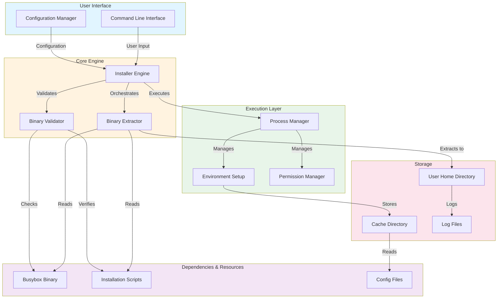

# Busybox Installer (No Root) - Architecture Overview

## System Architecture

## Component Description

### User Interface Layer
- **Command Line Interface (CLI)**: Entry point for user interactions and command execution
- **Configuration Manager**: Handles user preferences and installation settings

### Core Engine Layer
- **Installer Engine**: Main orchestrator coordinating the installation process
- **Binary Extractor**: Extracts and prepares Busybox binary and supporting files
- **Binary Validator**: Ensures integrity and compatibility of extracted binaries

### Dependencies & Resources
- **Busybox Binary**: The main binary executable
- **Installation Scripts**: Supporting shell scripts for setup
- **Config Files**: Configuration templates and defaults

### Execution Layer
- **Process Manager**: Manages subprocess execution without requiring root privileges
- **Environment Setup**: Configures runtime environment variables and paths
- **Permission Manager**: Handles file permissions within user constraints

### Storage Layer
- **User Home Directory**: Primary installation location (no root required)
- **Cache Directory**: Temporary storage for extracted files
- **Log Files**: Operation logs and diagnostics

## Installation Flow

1. User invokes CLI with installation parameters
2. Configuration Manager validates user settings
3. Installer Engine initializes the installation process
4. Binary Validator checks Busybox compatibility
5. Extractor unpacks binary to User Home Directory
6. Permission Manager sets appropriate file permissions
7. Environment Setup configures paths and variables
8. Process Manager initiates Busybox functionality
9. Logs and status information are recorded

## Key Design Principles

- **No Root Required**: All operations confined to user-accessible directories
- **Modular Architecture**: Separated concerns for maintainability
- **Validation-First**: Comprehensive checks before execution
- **Error Logging**: Detailed logs for troubleshooting
